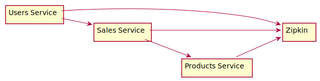
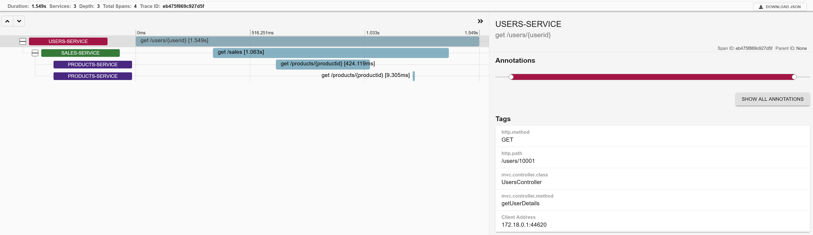

# Spring Cloud Sleuth Demo

### Description

A multi-module project that demonstrates the usage of the `Spring Cloud Sleuth` framework for distributed tracing. The project contains three
modules/services listed in the table below:

| Module             | Description                                          |
|--------------------|------------------------------------------------------|
| users-service      | Contains data about the users and their purchases.   |
| sales-service      | Contains data about performed sales.                 |
| products-service   | Contains data about the sold products.               |

Every module/service is implemented as a Spring Boot application and uses the `spring-cloud-starter-sleuth` library to enable auto-configuration for
distributed tracing. Additionally, for every service we also use the library `spring-cloud-sleuth-zipkin`, which enables the services to generate and
report Zipkin-compatible traces. The list of used frameworks/technologies is:

```
  Java                      11
  Gradle                    6.3
  Spring Boot               2.2.6.RELEASE
  Spring Cloud              Hoxton.SR3
  Docker                    19.03.8
  Docker-Compose            1.25.5
```

### Building & Running the project

The complete project can be built with the following command executed at top level:

```shell
./gradlew clean build
```

The previous command will build all services/modules. Finally, we can start each service by executing the following command in the corresponding
module:

```shell
./gradlew bootRun
```

### Starting the services with Docker-Compose

In order to ease the configuration and startup of the services, we have containerized each service with Docker. Since the services depend on each
other and additionally depend on Zipkin, we have written a docker-compose file that orchestrates the startup of all services (including Zipkin). In
order to build all Docker images we execute the following command at top level:

```
docker-compose build
```

The previous command will generate the following Docker images:

* bzb0/sleuth-demo-users-service:0.0.1-SNAPSHOT
* bzb0/sleuth-demo-sales-service:0.0.1-SNAPSHOT
* bzb0/sleuth-demo-products-service:0.0.1-SNAPSHOT

Finally, we can start all services with the following docker-compose command:

```shell
docker-compose up
```

The image below displays the started services (containers) and the dependencies between them:



In order to stop all containers, we simply execute:

```shell
docker-compose down
```

### Monitoring the services

After starting all services we can monitor a distributed call with Zipkin. The Zipkin UI is available at `http://localhost:9411/zipkin/`. The
`users-service` exposes a single REST endpoint, namely `GET /users/{id}`, so after sending an HTTP GET request we can monitor the call in the Zipkin
UI. A screenshot from a distributed trace is displayed in the image below:


